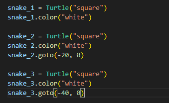
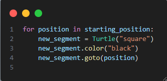

# Creating a Snake Game in Python

* Step 1 - Create a snake body

* Step 2 - Move the snake

* Step 3 - Create snake food

* Detect collision with food

* Create a scoreboard

* Detect collision with wall

* Detect collision with tail
