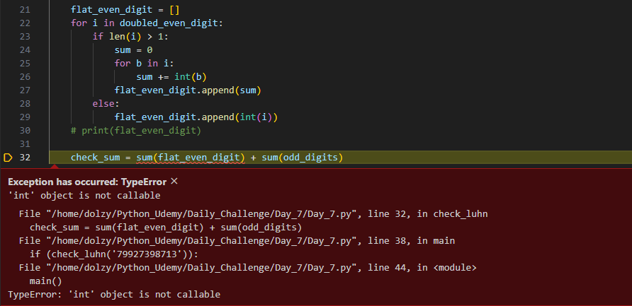
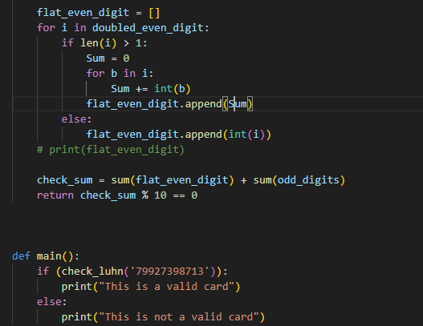

# The Luhn Algorithm

The luhn algorithm, also known as the modulus 10 or mod algorithm, is a simple checksum formula used to validate a variety of identification numbers, such as credit cards numbers, IMEI numbers, Canadian Social Insurance Numbers.

## Steps to solving the algorithm

* Step 1 -> Starting from the rightmost digit, double the value of every second digit.

* Step 2 -> If doubling of a numbers results in a two digit number i.e greateer than 9 (e.g., 6x2=12), then add the digits of the products (e.g 12: 1+2=3, 15: 1+5=6), to get a single digit number.

* Step 3 -> Now take the sum of all the digits.

* Step 4 -> if the total modulo 10 is equal 0 (if the total endsin zero) then the number is valid according to the Luhn formula; else it is not valid.

## Lesson learnt

In the build process of the code, I had a bug when I was trying to get the sum of my list because I used the `sum` word as a variable in the earlier phase of the code, so the program was picking my integer variable as the method to sum up the content of my list.

Resolution
To resolve this bug, I changed the variable name I initiated from `sum` to `Sum`. So it is quite important to names variables properly while writing code and avoid using keywords as variable names.

